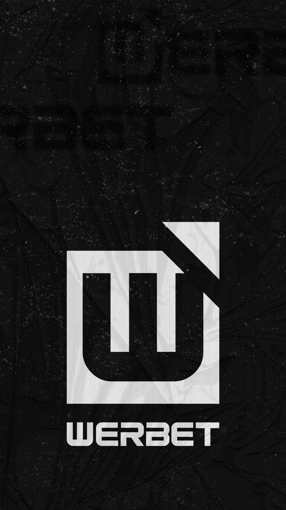

<h1 align="left">Hi 👋🏾, I'm Werbet Ribeiro</h1>

<p align="left">

```js
const werbet = {
  variant: 'Dev Front-End',
  since: '2022',
  studying: {
    course:'Análise e Desenvolvimento de Sistemas',
    progresse: '2/5',
  }
  message:'Programadores e artistas são os únicos profissionais que tem como hobby a própria profissão.
  – Rafael Lain'
}
```

<p>

<p align="left">

# Skills

&nbsp;
&nbsp;
&nbsp;
&nbsp;
&nbsp;

# Learning
&nbsp;
&nbsp;
&nbsp;
&nbsp;

<p>
