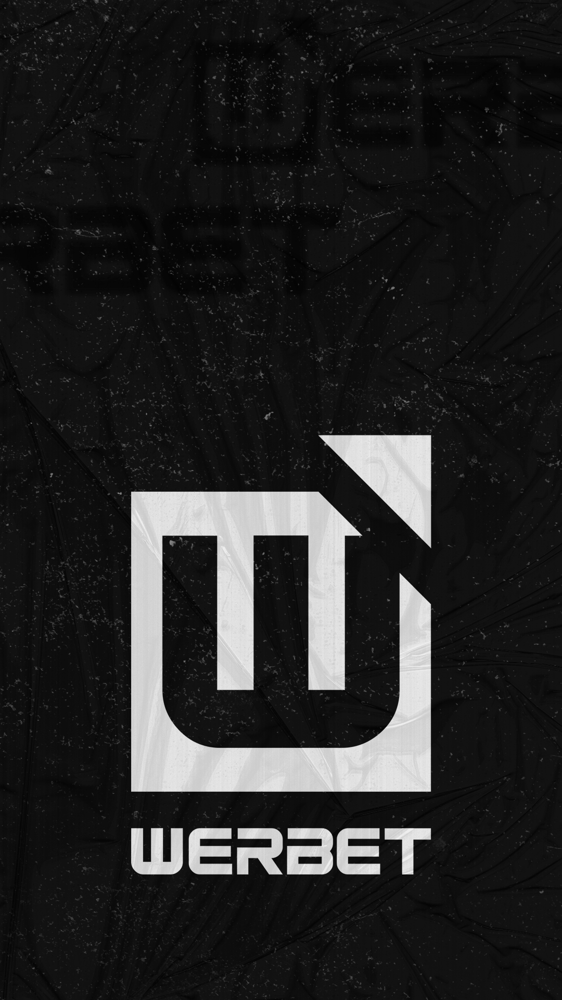

<h1 align="left">Hi 👋🏾, I'm Werbet Ribeiro</h1>

<p align="left">

```js
const werbet = {
  variant: 'Dev Web and Mobile, Front-End',
  since: '2022',
  formation: 'Análise e Desenvolvimento de Sistemas',
  message: 'Programadores e artistas
  são os únicos profissionais que tem como hobby
  a própria profissão. – Rafael Lain'
}
```

<p>

<p align="left">

# Skills
&nbsp;
&nbsp;
&nbsp;
&nbsp;
&nbsp;
&nbsp;
&nbsp;
&nbsp;

<p>
